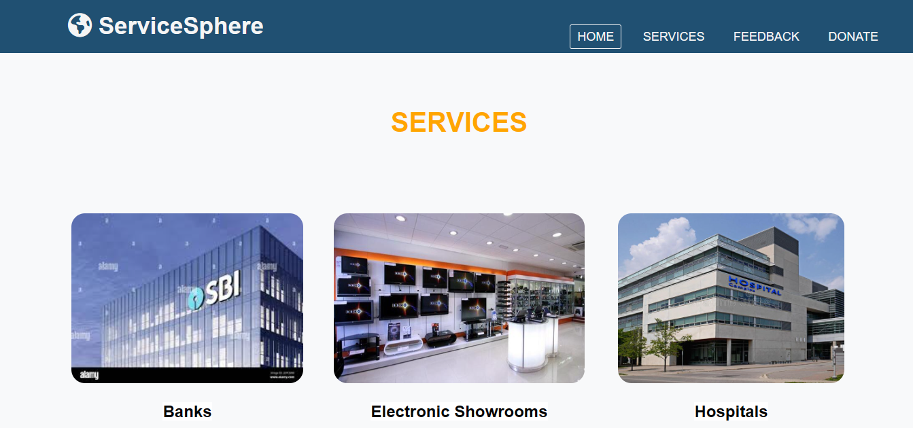

# 🌐 Service Sphere

> **A Centralized Community Asset Management Web App**  
Service Sphere is a dynamic web platform that bridges the information gap between local communities and essential services such as schools, hospitals, police stations, and more. Designed with simplicity and accessibility in mind, it enables users to search, discover, and interact with vital community resources.

---

## 📌 Table of Contents

- [🚀 Overview](#-overview)
- [✨ Features](#-features)
- [🧠 Technologies Used](#-technologies-used)
- [🗂️ Folder Structure](#️-folder-structure)
- [🧾 Database Schema](#-database-schema)
- [⚙️ How to Run Locally](#️-how-to-run-locally)
- [📸 Screenshots](#-screenshots)
- [🔐 Admin Access](#-admin-access)
- [🔮 Future Enhancements](#-future-enhancements)
- [📚 References](#-references)

---

## 🚀 Overview

Service Sphere is a **community information hub** where residents can:
- Explore local community services (like hospitals, schools, stores, ATMs).
- Provide feedback and suggestions.
- Make donations via QR.
- Search services by **district and taluk**.
- Enable **admins** to manage services, feedback, and donations from a secure dashboard.

---

## ✨ Features

- 🌍 Location-based service listings (District & Taluk)
- 📜 Dynamic directory of hospitals, schools, stores, and emergency contacts
- 💬 Resident Feedback system
- 💰 QR-based Donation form with details capture
- 🧑‍💼 Secure Admin Login and Dashboard
- 🛠 Admin capabilities to add/edit/delete:
  - Categories
  - Services
  - Taluks & Districts

---

## 🧠 Technologies Used

| Category          | Technology       |
|------------------|------------------|
| 💻 Frontend       | HTML5, CSS3, JavaScript |
| 🖥 Backend         | PHP 8.3          |
| 🗃 Database        | MySQL            |
| ⚙ Server Stack    | WAMP Server (Apache + MySQL + PHP) |
| 🖥 Dev Environment | Windows 11, Sublime Text |

---

## 🗂️ Folder Structure

```

service-sphere/
├── index.html
├── admin/
│   ├── login.php
│   ├── dashboard.php
│   └── manage\_taluk.php
├── assets/
│   └── images/
├── css/
│   └── style.css
├── js/
│   └── script.js
├── db/
│   └── connect.php
├── feedback/
│   └── form.php
├── donate/
│   └── donate.php
└── README.md

````

---

## 🧾 Database Schema

### 1. `admin_login`
| Field       | Type     |
|-------------|----------|
| admin_id    | INT (PK) |
| user_name   | VARCHAR  |
| password    | VARCHAR  |

### 2. `category`
| Field         | Type     |
|---------------|----------|
| category_id   | INT (PK) |
| category_name | VARCHAR  |
| image         | VARCHAR  |

### 3. `district`
| Field         | Type     |
|---------------|----------|
| district_id   | INT (PK) |
| district_name | VARCHAR  |

### 4. `taluk`
| Field       | Type     |
|-------------|----------|
| taluk_id    | INT (PK) |
| taluk_name  | VARCHAR  |
| district_id | INT (FK) |

### 5. `services`
| Field        | Type     |
|--------------|----------|
| service_id   | INT (PK) |
| category_id  | INT (FK) |
| district_id  | INT (FK) |
| taluk_id     | INT (FK) |
| name         | VARCHAR  |
| address      | VARCHAR  |
| mobile_no    | INT      |
| email_id     | VARCHAR  |

### 6. `donation`
| Field           | Type     |
|-----------------|----------|
| donation_id     | INT (PK) |
| full_name       | VARCHAR  |
| email_id        | VARCHAR  |
| address         | VARCHAR  |
| mobile_no       | INT      |
| donation_amt    | INT      |
| donation_comment| VARCHAR  |

### 7. `feedback`
| Field     | Type     |
|-----------|----------|
| feedback_id | INT (PK) |
| name        | VARCHAR  |
| email_id    | VARCHAR  |
| feedback    | TEXT     |

---

## ⚙️ How to Run Locally

### 1. Clone the Repository

```bash
git clone https://github.com/yourusername/service-sphere.git
cd service-sphere
````

### 2. Start WAMP/XAMPP

* Move folder to `www` (WAMP) or `htdocs` (XAMPP)
* Start Apache & MySQL

### 3. Import Database

* Open `phpMyAdmin`
* Create a database named `servicesphere`
* Import `servicesphere.sql` (add this to your repo if not present)

### 4. Run on Browser

```bash
http://localhost/service-sphere/
```

---

## 📸 Project Preview




* 🏠 Home Page
* 🗺️ District/Taluk Selection
* 🏥 Service Page
* 💬 Feedback Form
* 💰 Donation Page with QR
* 🔐 Admin Login
* 🛠️ Admin Dashboard (Add/Edit/Delete)

---

## 🔐 Admin Access

* **Login Page**: `/admin/login.php`
* Admin has access to:

  * Manage Categories
  * Add/Update/Delete Services
  * Manage Feedback & Donations

---

## 🔮 Future Enhancements

* 📲 Launch mobile app version
* 💳 Add secured online payment gateway
* 🌟 Enable service rating & photo uploads
* 🧠 AI-based service recommendations
* 🧑‍🤝‍🧑 Community discussion board
* 📍 Real-time geo-location for services
* 📢 Integration with social media & alerts


## 👨‍💻 Developed By

**Ravi M Shetty**  
📍 Bangalore, India  
💼 Frontend Developer | Python | PHP | Full-Stack Enthusiast  
🌐 [Portfolio](https://ravishetty-portfolio.netlify.app/)  
🔗 [LinkedIn](https://www.linkedin.com/in/ravi-m-shetty/)  
💻 [GitHub](https://github.com/Ravishetty07)  
📧 ravishetty050822@gmail.com  


